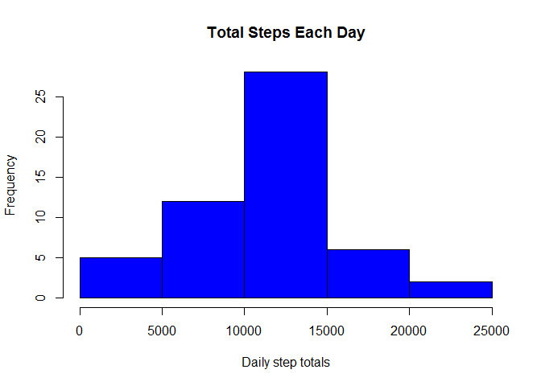
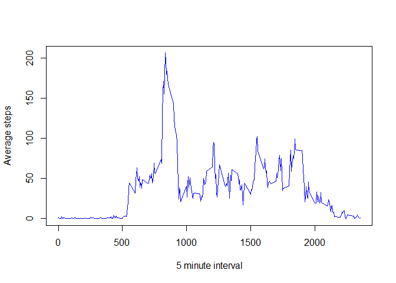
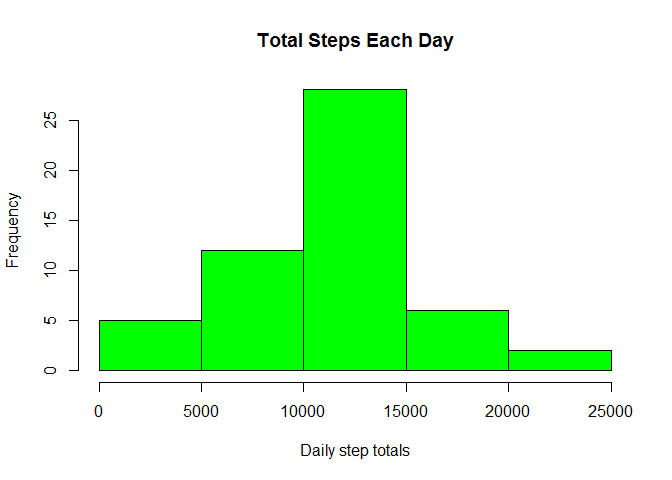
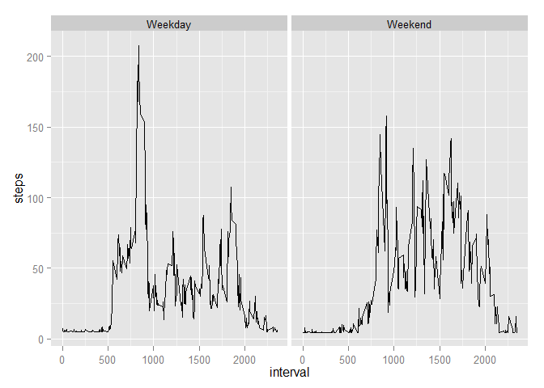

# Reproducible Research Assignment 1
Ken Ammerman  
Wednesday, Sept 3rd, 2014  


## Assignment
To create a single R markdown document that contains the assignment answers 
along with the code used to load, transform, process and visualize date 
obtained from a [Activity Monitoring data](https://d396qusza40orc.cloudfront.net/repdata/data/activity.zip) dataset.


##### Load the data from the .csv extracted to a ./data sub-directory in the 
##### current working directory.


```r
library(ggplot2)

srcFile <- "data/activity.csv"
activityData <- read.csv(srcFile, header=TRUE, sep = ",")
```

Display the structure of the date loaded

```r
str(activityData)
```

```
## 'data.frame':	17568 obs. of  3 variables:
##  $ steps   : int  NA NA NA NA NA NA NA NA NA NA ...
##  $ date    : Factor w/ 61 levels "2012-10-01","2012-10-02",..: 1 1 1 1 1 1 1 1 1 1 ...
##  $ interval: int  0 5 10 15 20 25 30 35 40 45 ...
```

##### Sumarize the step counts to a daily total 


```r
dailyData <- aggregate(steps ~ date, activityData, sum)
```

##### Create a histogram of the total number of steps taken per day


```r
hist(dailyData$steps, xlab="Daily step totals", 
     main="Total Steps Each Day", col="blue")
```

 

##### Mean Total numner of steps per day

```r
mean(dailyData$steps)
```

```
## [1] 10766
```

##### Median total number of steps each day

```r
median(dailyData$steps)
```

```
## [1] 10765
```


##### Plot the average daily activity pattern

```r
averageData <- aggregate(steps ~ interval, activityData, mean )
plot(averageData,xlab="5 minute interval",
     ylab="Average steps", type='l',col="blue")
```

 

To find the 5 minute interval with the maximum average daily steps

```r
averageData[which.max(averageData[,2]),]
```

```
##     interval steps
## 104      835 206.2
```


#### Input missing values by using the average daily values for an interval
##### Calculate the Total number of missing values

```r
sum(is.na(activityData))
```

```
## [1] 2304
```


#### Replace missing values with the mean of the daily steps.
##### This is not intended to be a sophisticated solution, simply replace the
##### NA values with the average interval value

```r
avgSteps <- mean(activityData$steps, na.rm = TRUE)
newActivityData <- activityData
newActivityData = replace(newActivityData, is.na(newActivityData), avgSteps)
```

##### structure of newActivityData

```r
str(newActivityData)
```

```
## 'data.frame':	17568 obs. of  3 variables:
##  $ steps   : num  37.4 37.4 37.4 37.4 37.4 ...
##  $ date    : Factor w/ 61 levels "2012-10-01","2012-10-02",..: 1 1 1 1 1 1 1 1 1 1 ...
##  $ interval: int  0 5 10 15 20 25 30 35 40 45 ...
```


##### Create a histogram using the average steps values to replace the intervals
##### containing missing steps data

```r
newDailyData <- aggregate(steps ~ date, activityData, sum)

hist(newDailyData$steps, xlab="Daily step totals", 
     main="Total Steps Each Day", col="green")
```

 

##### new mean

```r
mean(newDailyData$steps)
```

```
## [1] 10766
```

##### and new median

```r
median(newDailyData$steps)
```

```
## [1] 10765
```

#### Changes in activity between weekdays and weekends
##### Create a new variable that identified mid-week and weekend days in the
##### newActivityData data set.

```r
newActivityData$day <- ifelse ((weekdays(as.Date(newActivityData$date)) 
                            %in% c('Saturday','Sunday')), 'Weekend', 'Weekday')
```

##### Plot the average number of steps taken per 5 minute interval across all 
##### days grouped by weekday and weekend

```r
qplot(interval, steps, 
      data = aggregate( steps~day+interval, newActivityData, mean ),
      facets = .~day, geom="line")
```

 
